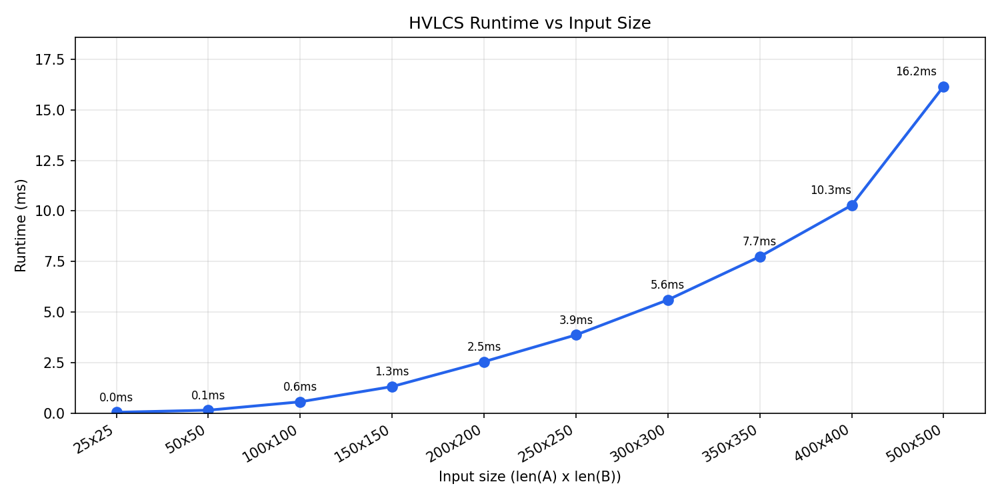

# Highest Value Longest Common Subsequence (HVLCS)

## Students
- Gabriel Burger UFID: 89739533
- CJ Alexander UFID: 51691777

## How to Run

### Run the solver
```bash
python3 src/hvlcs.py src/data/input/input1.txt
```

### Reproduce the worked example
```bash
python3 src/hvlcs.py src/examples/examplein.txt
```
Expected output:
```
9
cb
```

### Run the benchmarker and generate the runtime graph
```bash
python3 src/graph.py
```
Output files will be saved to `src/data/output/` and the graph to `src/results/runtime_graph.png`.

## Dependencies
- Python
- matplotlib (`pip install matplotlib`)

## Question 1


Ten input files were generated with string lengths ranging from 25x25 up to 500x500. Runtime grows as input size increases, consistent with the **O(mn)** complexity.

## Question 2

OPT(i, j) is the maximum value common subsequence of a_1...a_i and b_1...b_j

The base cases (if either a or b is empty, there is no common subsequence, so the value is 0):
- OPT(0, j) = 0 for all j
- OPT(i, 0) = 0 for all i

There are three possibilites at any position i in A and j in B:
- case 1: matched, if a_i = b_j, then v(a_i or b_j) + OPT(i - 1, j - 1)
- case 2: skip a, OPT(i -1, j)
- case 3: skip b, OPT(i, j - 1)

Therefore, our recurrence is
```
OPT(0, j) = 0
OPT(i, 0) = 0

OPT(i, j) = max({If aᵢ = bⱼ: v(aᵢ) + OPT(i−1, j−1)}, OPT(i−1, j), OPT(i, j−1))
```

The reason why this is correct is because at any position i in A and j
in B, the three cases defined are exhaustive. We store the maximum value of the cases and repeat this on all remaining subproblems.

## Question 3

First we have to find the highest value common subsequence:

```
for i = 0 to n
  M[i][0] = 0

for j = 0 to m
  M[0][j] = 0

for i = 1 to n          # runtime is O(m * n)
  for j = 1 to m
    if a_i == b_j
      M[i][j] = max(v(a_i) + M[i-1][j-1], M[i-1][j], M[i][j-1])
    else
      M[i][j] = max(M[i-1][j], M[i][j-1])

return M[n][m]
```

Then, we can backtrack in order to find the length of it:

```
i = n
j = m
result = empty list

while i > 0 and j > 0           # runtime is O(m + n)
  if a_i == b_j and M[i][j] == v(a_i) + M[i-1][j-1]
    add a_i to front of result
    i = i - 1
    j = j - 1
  else if M[i-1][j] >= M[i][j-1]
    i = i - 1
  else
    j = j - 1

return result
```

Overall runtime is O(mn) for the DP table and O(m + n) for the traceback, giving a total runtime of **O(mn)**.
